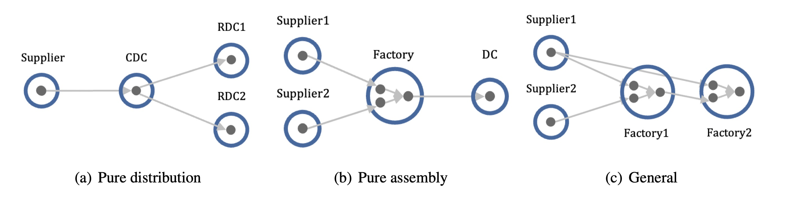
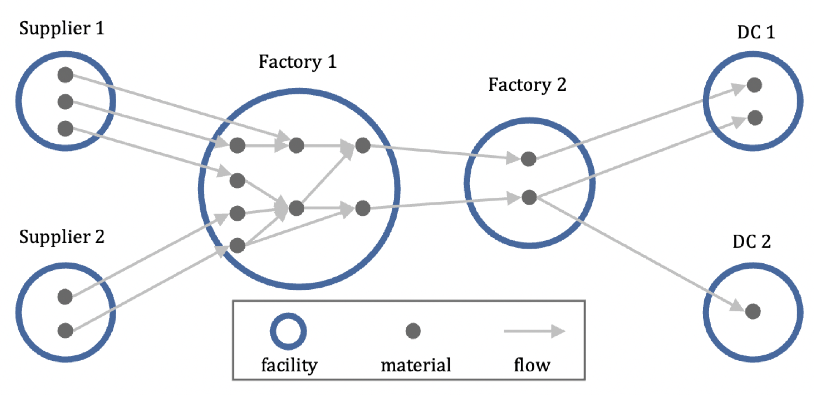
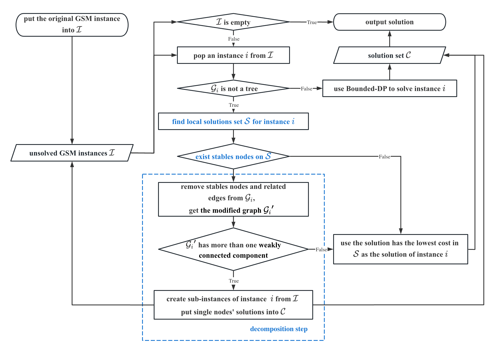

# Inventory Network Optimization (InvNet) GSM-Lab

https://github.com/durianh96/InvNet-GSM

This library is part of an open source project called InvNet(to add link), and it is based on our paper:

- Huang D, Yu J, Yang C, Optimizing large-scale inventory networks: An iterative decomposition approach (Revision at EJOR).

This library provides the Python codes for data loading, data generation and all methods considered in this paper.

If you encounter any significant bugs, then please contact [Diyuan Huang](huang.diyuan96@gmail.com).

Optimizing safety stock placement on a large-scale inventory network is challenging since it may involve a massive number of nodes and many shared materials. 

From a structural perspective, a supply chain can be viewed as a collection of connected facilities, ranging from suppliers' warehouses, factories, and distribution centers to the end sales channels.
The flow of materials through these facilities can be modeled as an inventory network. 
The following figure shows some inventory networks with different structures. The blue cycles represent facilities.




The material at each facility is a potential inventory stocking node. We abbreviate it as "node", indicated as black dots in figures. 
The transportation and assembly relationships are modeled as directed edges (grey arrows). 
From a topological point of view, the inventory network is a directed acyclic graph (DAG) composed of these nodes and edges.

In practice, the inventory network is complex and usually not a simple tree structure, especially when the production process is incorporated into the network. This process often has many components, which are shared to produce different assemblies. 

Coping with uncertainty is one of the most significant issues for real-world supply chain management. The optimization of where to place decoupling inventories that protect one part of the supply chain from another can effectively enhance the resilience of the supply network to deal with uncertainties, and improve the operational efficiency of the network. 
However, inventory management for networks under uncertainty is challenging even for the tree structure. 

Deriving optimal structural policies for pure distribution and assembly network is intractable due to the complex non-linearity of the cost functions and the well-known curse of dimensionality in dynamic programming (de Kok et al. 2018). 

Unfortunately, real-world problems usually have a general network structure and often contain a large number of nodes.
"General" means a node can have multiple upstream nodes and multiple downstream nodes.
In the management of such networks, it is necessary to consider both the distribution of materials and the assembly relationships. 



Two critical issues that arise for inventory networks are:

- choosing which nodes to place inventory 
- how much to set

The guaranteed service model (GSM) is one of the main approaches to optimizing network inventory policy. 
We recommend the users to (Graves and Willems 2000), (Eruguz et al. 2016) and (Huang et al. 2022) for more details about the basics of GSM.


## Approaches considered in this library

This library provides several approaches to solve the GSM to optimize network inventory policy.
Readers can either input a GSM instance or specify several parameters to generate an instance, and then run the different methods to find solutions and compare their performance.

We design a novel approach, called the **iterative decomposition (ID-SLP) approach**, to efficiently solve the guaranteed service model (GSM) to optimize the inventory policy for large-scale inventory networks.

This approach decomposes the problem iteratively by analyzing local solutions obtained from a non-convex optimization method (sequential linear programming) and selecting the appropriate algorithm to solve each sub-problem based on its specific network structure.

This figure shows the framework of our iterative decomposition approach:



It has three main steps: 

1. Finding local solutions for general structure GSM Instance.

   In this step, we use sequential linear programming (SLP, also called successive linear programming), a local optimization method that iteratively approximates the original non-convex GSM problem with linear sub-problems to find local solutions. The parameter *local sol num* stands for how many local solutions need to be found.

2. Finding stable nodes from local solutions.

   We try to find stable nodes by selecting those nodes whose variable values are consistent across the local solutions. 
   We use the coefficient of variation (CV, the ratio of the standard deviation to the mean) to assess whether a node is stable. 
   *Stability threshold* is a parameter need to be tuned in practice.
   It determines whether the network can be decomposed. 

3. Decompose the GSM instance from stable nodes and build sub-instances.

For more details, please refer to our paper (Huang et al. 2022).

Other seven approaches of solving GSM are provided in this library: 

- **Dynamic programming (GW-DP)** from (Graves and Willems 2000).
  This approach was designed for tree networks; it takes advantage of the fact that in any tree, each node can be labeled with a unique index such that every node except one has at most one adjacent node with an index higher than its own.

- **Heuristic general networks algorithm (HGNA)** from (Humair and Willems 2011).
  This paper combines the GW-DP algorithm with a branch-and-bound scheme and provides an exact solution approach called the **general networks algorithm (GNA)**.
  GNA can find optimal solutions for general networks, but takes a long time to find the solution for large-scale problems (the authors provide an example 2,025-node problem that takes 577,190.78 seconds to find the optimal solution). The authors also provide two faster heuristics: **HGNA** and **TGNA**. 
  HGNA is motivated by the structure of the formulation's dual space, whereas TGNA simply terminates the optimization algorithm after a fixed number of iterations.
  We found that compared with TGNA, HGNA takes a long time to find solutions to large-scale problems but is able to find a lower-cost solution.  
  We add a parameter *max iter num* to terminate HGNA after a fixed number of iterations, like TGNA. 
  With larger *max iter num*, the quality of the solution will be higher, while the solution time will increase.

- **Piecewise linear approximation (PWL)** from (Magnanti et al. 2006).
  This approach uses piecewise linear functions to approximate the GSM's objective function. This turns the original GSM into a mixed integer programming (MIP) problem that can be solved with an MIP solver. We will terminate the solver and return the results when the gap between the lower and upper objective bounds is less than *opt gap*, times the absolute value of the incumbent objective value.
  With smaller *opt gap*, the quality of the solution will be higher, while the solution time will increase.

- **Dynamic sloping (DS)** and **iterative mixed integer programming (IMIP)** from (Shu and Karimi 2009). 
  This paper provides two efficient iterative heuristics, DS and IMIP. The DS uses continuous approximation, while the IMIP employs a two-piece linear approximation to approximate the concave objective function. Accordingly, the DS needs to solve a linear problem and the IMIP needs to solve a MIP problem iteratively.  In their numerical studies, the IMIP outperforms the DS in solution quality consistently and the latter outperforms the former in solution speed consistently. A noteworthy feature of these two approaches is that the quality of solutions does not deteriorate with an increase in network size.   

- **Simulated annealing (SA)** from (Grahl et al. 2016).
  This paper investigates the performance of three meta-heuristics, local search, genetic algorithm, and simulated annealing on solving GSM. SA outperforms the other two meta-heuristics with respect to speed and solution quality. 
  Therefore we choose SA as a representative of meta-heuristics. 

- **Simple sequential linear programming (Simple-SLP)** from (Huang et al. 2022).
  In the ID approach, if the underlying graph can not be decomposed, we then simply output the local solution with the smallest total inventory cost. 
  We can also apply this approach directly to solve for GSM without decomposition.
  We call this approach **Simple-SLP**. The parameter *local sol num* stands for how many local solutions need to be found. With larger *local sol num*, more local solutions will be found.
  Therefore, the possibility of finding a lower-cost solution will also be higher. 

## Data loading and  generating

A GSM instance $i$ contains a graph $\mathcal{G}_i = (\mathcal{N}_i, \mathcal{A}_i)$, all properties of nodes and edges related to GSM, including demand functions, unit holding costs, lead times, and service time requirements for demand nodes.

The reader can input the number of edges and nodes and the network structure to generate a graph, then generate properties on the generated graph. Or input a graph and then generate properties.

We highly recommend generating related data at least once to understand how to prepare their own instance for users who want to import their self-data.

First, we import some functions for data processing:


```python
from utils.edges_loader import edges_loading_from_willems, edges_loading_from_huang
from utils.edges_generator import edges_generating_by_type
from gsm.generator.gsm_instance_generator import gsm_instance_generating_given_paras_ranges
```

User can load their own edges or generating edges then building an instance. 
We provide two exist graph resource for papers. And provide a edges generation function for users.

We provide function **'edges_loading_from_willems'** to load edges from (Willems 2008).
This paper provides 38 real supply chains, which all have a general network structure.
They are also used in Section 4.1 of (Huang et al. 2022).
The parameter *data_id* stands for the index of their chains.

Take chain 10 as an example, we can load the edges with the following codes:


```python
willems_edges = edges_loading_from_willems(data_id=10)
print(willems_edges[:5])
```

    [('N006', 'N054'), ('N026', 'N053'), ('N001', 'N055'), ('N012', 'N052'), ('N050', 'N056')]


 We provide function **'edges_loading_from_huang'** to load edges presented in Table 4 of (Huang et al. 2022).
 the parameter *avg degree* stands for the average degree of those four graphs.

 To load the corresponding edges with average degree equals to 5, we can:


```python
huang_edges = edges_loading_from_huang(avg_deg=5)
```

We provide function **'edges_generating_by_type'** to generate graphs with the specified number of nodes, number of edges, and network structure. 

The idea is presented in Section 4.2 of (Huang et al. 2022). 
To use it, users need to specify the following three parameters:

- *nodes num*: the number of nodes.
- *edges num*: the number of edges (can be empty for serial, assembly, and distribution graph).
- *graph type*: the graph structure, it can be 'serial', 'assembly', 'distribution' and 'general'.

For example, we can generate a general structure graph with 1000 nodes and 5000 edges: 


```python
nodes_num = 1000
edges_num = 5000
graph_type = 'GENERAL'
random_edges = edges_generating_by_type(nodes_num=nodes_num, edges_num=edges_num, graph_type=graph_type)
```

We provide function **'gsm_instance_generating_given_paras_ranges'** to generate random properties and build an GSM instance. The idea is presented in Appendix A of (Huang et al. 2022).
To use it, users need to specify the following parameters:

- *qty lb* and *qty ub*: the edge proportion range that are set to 1 and 3 as default;
- *lt lb* and *lt ub*: the lead time range that are set to 1 and 10 as default;
- *hc lb* and *hc ub*: the holding cost range that are set to 0 and 1 as default;
- *sla lt lb* and *sla lt ub*: the service time requirement range that are set to 0 and 10 as default;
- *demand mean lb* and *demand mean ub*: the demand mean range that are set to 50 and 100 as default;
- *demand std lb* and *demand std ub*: the demand standard deviation range that are set to 1 and 10 as default;
- *tau*: the service level that is set to 0.95 as the default.

With this function and the default parameters, we can generate three instances for the above three edges: 


```python
willems_gsm_instance = gsm_instance_generating_given_paras_ranges(instance_id='INSTANCE_01', edges=willems_edges)
huang_gsm_instance = gsm_instance_generating_given_paras_ranges(instance_id='INSTANCE_02', edges=huang_edges)
random_gsm_instance = gsm_instance_generating_given_paras_ranges(instance_id='INSTANCE_03', edges=random_edges)
```

## Inventory policy optimizing

To optimize the inventory policy on given instance, users first need to create a task, and specify:

- *task id*: the unique index of the task.
- *gsm_instance*: the instance that need to optimized.
- *approach name*: the solving approach. 

As mentioned before, for general structure problems, we provide seven approaches:

- 'HGNA'
- 'PWL'
- 'DS'
- 'IMIP'
- 'SA'
- 'Simple-SLP'
- 'ID-SLP'

The default parameters of these approaches is given in 'solving_default_paras.py'. More details about them can be found in (Huang et al. 2022).

For example, we can create three tasks from above instances with HGNA, DS and ID-SLP, respectively.


```python
from gsm.gsm_task import GSMTask
willems_task = GSMTask(task_id='TASK_01', gsm_instance=willems_gsm_instance, approach_name='HGNA')
huang_task = GSMTask(task_id='TASK_02', gsm_instance=huang_gsm_instance, approach_name='DS')
random_task = GSMTask(task_id='TASK_03', gsm_instance=huang_gsm_instance, approach_name='ID-SLP')
```

For the first task loaded, we optimize the inventory policy with HGNA:


```python
willems_task.run()
```

    2023-03-08 20:25:53,277 - /Users/durian/Nutstore Files/Research/InvNet/gsm/gsm_sol.py[line:249] - INFO: HGNA_safety stock cost is 1507.64
    2023-03-08 20:25:53,278 - /Users/durian/Nutstore Files/Research/InvNet/utils/system_utils.py[line:29] - DEBUG: func @get_policy use 1.16721 (s)


Except for the HGNA and SA, users can specify the solver for other approaches that involve solving linear or integer programming problems. 
We provide Gurobi (https://www.gurobi.com/) and COPT (https://www.shanshu.ai/copt) choices with their naive Python interface. We also use pyomo 6.4.2 for unified modeling in our library so that the reader can use any solver supported by pyomo.

We provide five choices of solver:

- *GRB* uses the Gurobi interface of Python.
- *COPT* uses the COPT interface of Python.
- *PYO_GRB* uses the pyomo to model and solve with Gurobi.
- *PYO_COPT* uses the pyomo to model and solve with COPT.
- *PYO_CBC* uses the pyomo to model and solve with COIN-CBC.

For more solvers such as Cplex, GLPK and SCIP, users can slightly modify the code of approach to add support.

Here, for the left two tasks generated from (Huang et al. 2022), we use Gurobi to optimize the policy with DS and ID-SLP approach: 


```python
huang_task.run(solver='GRB')
```


```python
random_task.run(solver='GRB')
```


## Reference

- Eruguz AS, Sahin E, Jemai Z, Dallery Y (2016) A comprehensive survey of guaranteed-service models for multi-echelon inventory optimization. International Journal of Production Economics 172:110–125. https://doi.org/10.1016/j.ijpe.2015.11.017
- Grahl, J., Minner, S., Dittmar, D., 2016. Meta-heuristics for placing strategic safety stock in multi-echelon inventory with differentiated service times. Annals of Operations Research 242, 489–504.
- Graves SC, Willems SP (2000) Optimizing strategic safety stock placement in supply chains. M&SOM 2:68–83. https://doi.org/10.1287/msom.2.1.68.23267
- Huang D, Yu J, Yang C (2022) Optimizing Large-scale Inventory Networks: An Iterative Decomposition Approach.
- Humair S, Willems SP (2011) TECHNICAL NOTE—Optimizing Strategic Safety Stock Placement in General Acyclic Networks. Operations Research 59:781–787. https://doi.org/10.1287/opre.1100.0913
- Magnanti TL, Shen Z-JM, Shu J, et al (2006) Inventory placement in acyclic supply chain networks. Operations Research Letters 34:228–238
- Shu J, Karimi IA (2009) Efficient heuristics for inventory placement in acyclic networks. Computers & Operations Research 36:2899–2904. https://doi.org/10.1016/j.cor.2009.01.001

